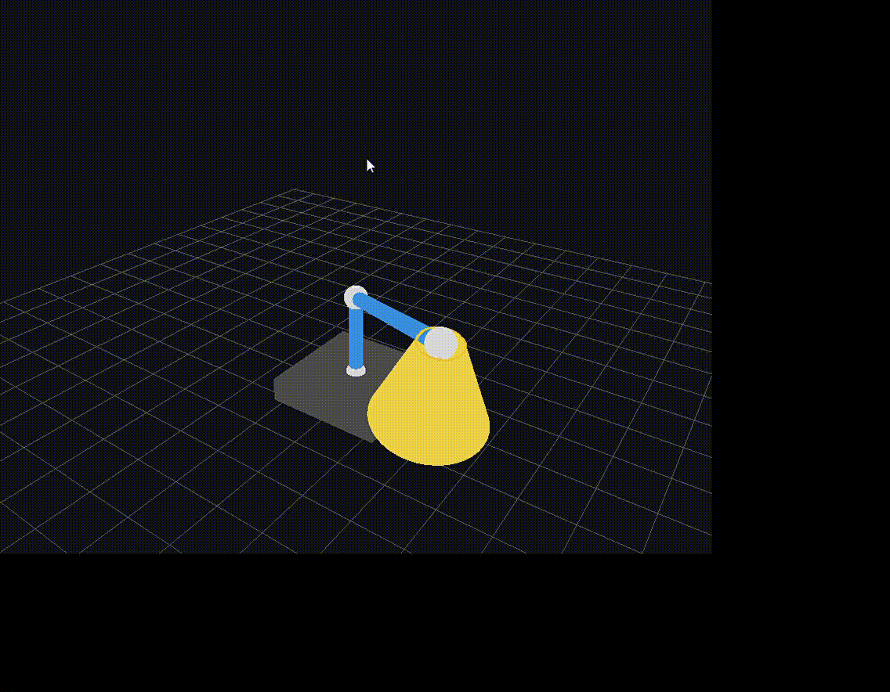
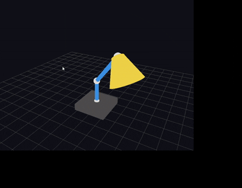

# HierarchicalModeling
https://stormy-airbus-32f.notion.site/Assignment-1-Hierarchical-Modeling-17f690c00943806dba77f04f65f77501


FK anim 구현.

## 실행 환경

* OS: Windows
* Language: C++
* IDE: Visual Studio
* freeglut :  https://www.transmissionzero.co.uk/software/freeglut-devel/
* glew :  http://glew.sourceforge.net/


## 문서 구조
```
HierarchicalModeling/
ㄴ-- HierarchicalModeling/
|   ㄴ--  main.cpp // 프로그램 진입점, OpenGL window/callback 설정
|   ㄴ--  HierarchicalModeling.h // HierarchicalModeling 클래스 선언
|   ㄴ--  HierarchicalModeling.cpp  // HierarchicalModeling 클래스 구현
ㄴ--  Assignment1_HierarchicalModel_keyframe.gif //영상
ㄴ--  HierarchicalModeling.slnx // Visual Studio 솔루션 구성 파일
```


## 구현 개념

부모 좌표계의 변환 × 자식 좌표계의 변환 = 자식의 월드 좌표계 변환.<br>
Hierarchical modeling에서 각 관절의 local angle만 저장.<br>
실제 화면에 그릴 때는 부모 변환들을 전부 곱해서 global position/orientation을 계산.<br>

#### 로드리게스 회전행렬 비슷하게 -> 계산된 axis와 angle을 함수에 전달 ####





<br>
<br>

## 모델 설명
```
Base //바닥에 놓인 원기둥 받침대
 ㄴ-- Neck Joint
     ㄴ--  Neck Link  //Base 위에서 시작되는 세로 원기둥 링크
          ㄴ--  Arm Joint
               ㄴ-- Arm Link //Neck 끝 관절에서 회전하는 팔 형태의 원기둥 링크
                    ㄴ-- Lamp Head Joint
                          ㄴ--  Lamp Head //Arm 끝 관절에 연결된원뿔 형태의 조명 갓
```


전체 변환은 부모에서 자식 방향으로 누적.
```
   T_head = T_base *T_neck_joint *T_neck_link *T_arm_joint *T_arm_link *T_head_joint *T_head_link
```


## 주요 함수 설명
AlignYAxisToVector : local y축 방향으로 만들어진 primitive를 실제 링크 방향으로 정렬.   <br>     
DrawCylinderY :항상 자신의 local y축 방향으로 원긷우 생성. <br>
DrawFloorGrid :3D 공간감을 확인하기 위한 바닥 격자. <br>
DrawFrustumBetween :y축 방향으로 절두원뿔을 만들고 T_frustum = Trans(p_start) dot R(e_y -> v_hat)수핼
DrawCylinderBetween : y축 방향으로 원기둥 만들고 Local-to-world transform 수행
DrawStandLamp() : 루트부터 현재 노드까지의 local transform을 순서대로 곱해서 각 노드의 최종 월드 변환.


